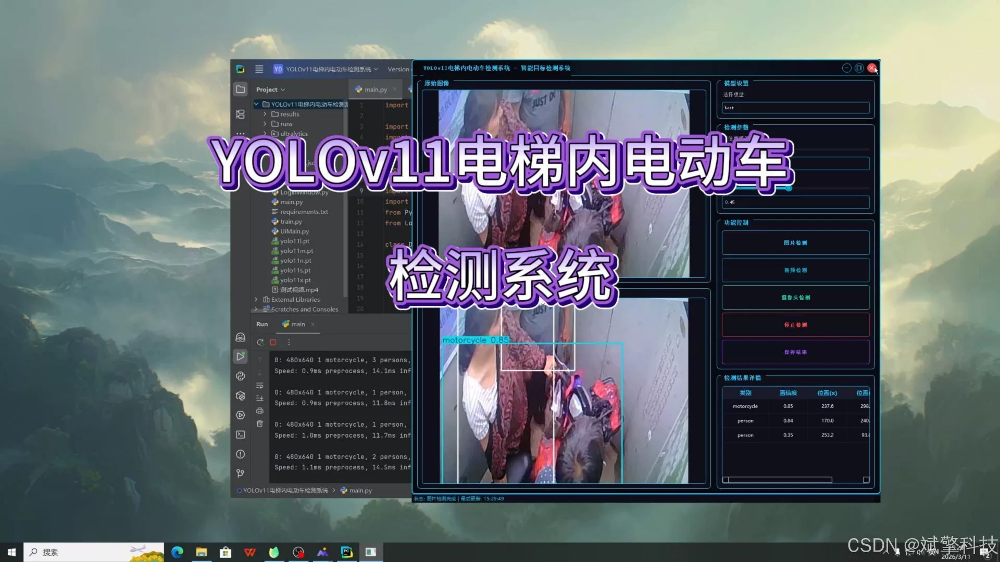
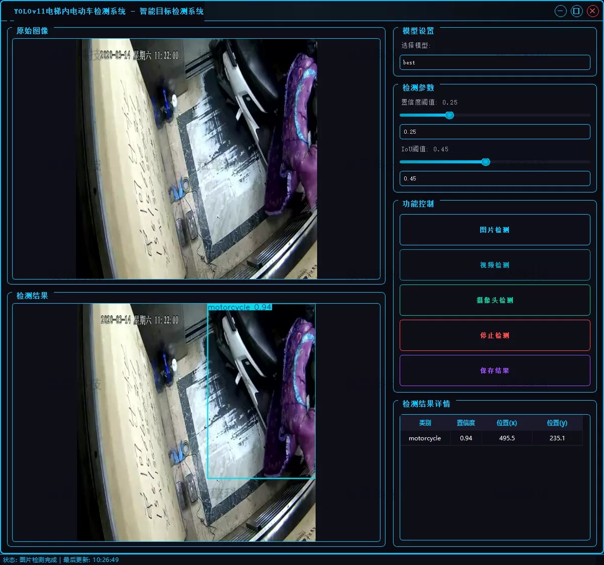
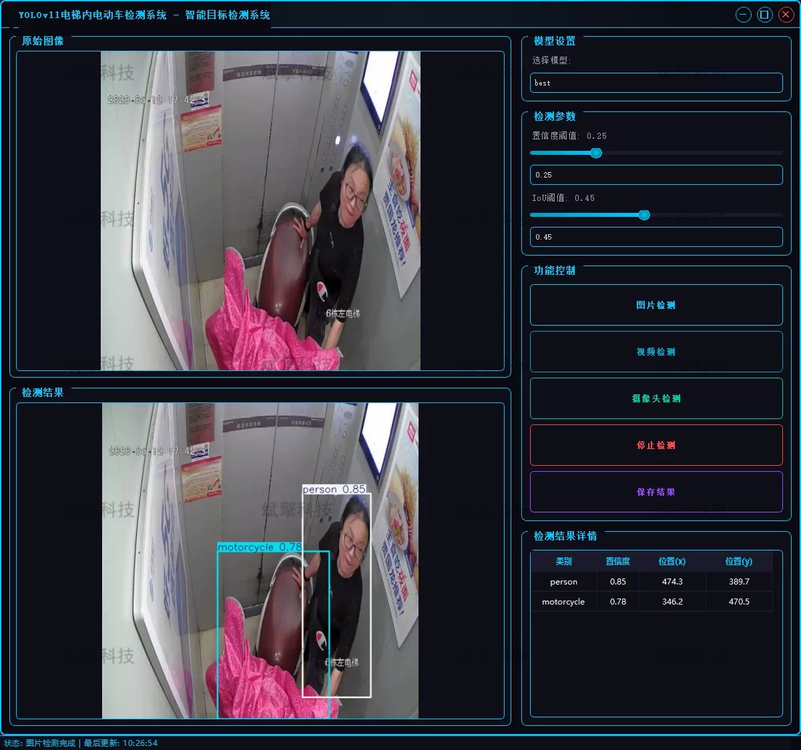

# Elevator Inside Electric Vehicle Recognition and Detection System Based on YOLOv11 Deep Learning (YOL)

## Body

Based on the YOLOv11 deep learning algorithm, this project has been designed and implemented to develop a detection system for electric vehicles inside elevators.

The system can accurately identify illegal entry of electric vehicles into elevators through real-time analysis of elevator surveillance video streams. The project covers three core functions: image detection, video file detection, and real-time camera detection. Experimental results show that the model performs excellently on its own dataset, demonstrating good real-time performance and robustness, which can provide efficient technical support for smart communities and elevator safety supervision.

Project Functionality Exhibition
✅ User Login and Registration: Supports password verification and security validation.
✅ Three Detection Modes: Based on the YOLOv11 model, supports image, video, and real-time camera detection, with precise identification of targets.
✅ Dual Screen Comparison: Display original images and detection results on the same screen.
✅ Data Visualization: Real-time table displaying the category, confidence, and coordinates of detected targets.
✅ Intelligent Parameter Tuning: Offers a confidence slide bar to dynamically optimize detection accuracy, adapting to different scene requirements.
✅ Sci-Fi Style Interactive Interface: Dark theme combined with dynamic light effects, reducing visual fatigue and improving operational experience.
✅ Multi-thread High-Performance Architecture: Independent detection threads ensure smooth operation, real-time status prompts, and rapid response without lag.

Dataset Introduction
Training set: 5291 images
Validation set: 1168 images
Test set: 652 images

## Images

## Payment

Here is a pay link on Stripe ( https://buy.stripe.com/3cs8yP7sY87d0vu9AB ). Please contact me lonlonago@foxmail.com after funding $89, and I will send you a complete data files , thank you!

